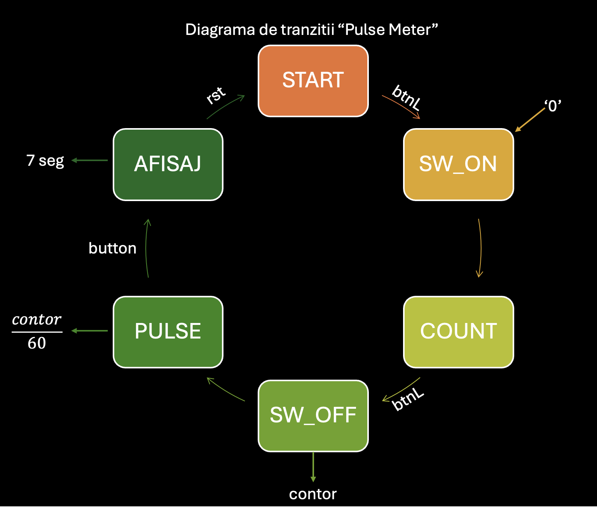

<h1 align="center"> Pulse Meter - FPGA Basys 3</h1>

  
  
  

---

<h2>Descriere Proiect</h2>

Acest proiect implementează un dispozitiv de măsurare a pulsului (BPM) utilizând o placă de dezvoltare **Basys 3**. Sistemul calculează frecvența impulsurilor primite prin intermediul unui buton și afișează rezultatul în timp real pe un display cu 7 segmente.

<ul>
  <li><b>Arhitectură:</b> FSM (Finite State Machine) cu 7 stări.</li>
  <li><b>Precizie:</b> Divizor de ceas de 1kHz pentru măsurarea duratei în ms.</li>
  <li><b>Conversie:</b> Modul dedicat Bin-to-BCD pentru afișaj.</li>
</ul>

---

<h2>Funcționare (Diagrama de Stări)</h2>

Logica sistemului este guvernată de un automat de stări finit (FSM). Mai jos este prezentată diagrama de tranziții originală care a stat la baza implementării VHDL:

  

Descrierea Stărilor:

<ol>
    <li><b>Start:</b> Starea inițială, așteaptă activarea sistemului.</li>
    <li><b>SwOn:</b> Înregistrează primul impuls (dezactivarea switch-ului).</li>
    <li><b>Inceput:</b> Pregătește contorul pentru măsurarea duratei.</li>
    <li><b>Count:</b> Starea activă de numărare, măsoară timpul dintre impulsuri.</li>
    <li><b>Final:</b> Înregistrează al doilea impuls și oprește măsurarea.</li>
    <li><b>Pulse:</b> Calculează valoarea pulsului (BPM) pe baza timpului măsurat.</li>
    <li><b>Afisaj:</b> Trimite valoarea calculată către modulele de conversie și afișare.</li>
</ol>

---

<h2>Mapare Pini (Basys 3)</h2>
<table>
  <tr>
    <th><b>Semnal</b></th>
    <th><b>Pin</b></th>
    <th><b>Descriere</b></th>
  </tr>
  <tr>
    <th>clk</th>
    <th>W5</th>
    <th>Ceas Principal(100MHz)</th>
  </tr>
  <tr>
    <th>rst</th>
    <th>U18</th>
    <th>Reset</th>
  </tr>
  <tr>
    <th>btnL</th>
    <th>W19</th>
    <th>Intrare Puls</th>
  </tr>
  <tr>
    <th>seg[0-6]</th>
    <th>W7-U7</th>
    <th>Segment Display 7-seg</th>
  </tr>
  <tr>
    <th>an[0-3]</th>
    <th>U2-W4</th>
    <th>Anozi Display 7-seg</th>
  </tr>
  
</table>

---

<h2>Limbaj si unelte folosite:</h2>
<ul>
  <li>
    <a href="https://www.xilinx.com/support/download/index.html/content/xilinx/en/downloadNav/vivado-design-tools/archive.html">
      Xilinix Vivado
  </li>
  <li>
    <a href="https://nandland.com/introduction-to-vhdl-for-beginners-with-code-examples/">
      VHDL
  </li>
</ul>

---

  <i>Realizat de Mădărășan Ioan-Alexandru</i>

